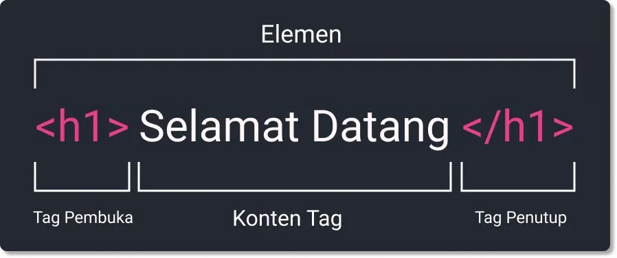
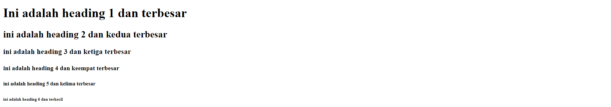
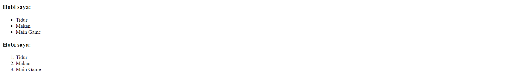

# Unix Command Line

- ## Command Line Interface (CLI)

  Command Line Interface (CLI) adalah sebuah program dimana user bisa mengetikkan perintah dalam bentuk teks dan memberikan instruksi pada komputer untuk mengerjakan tugas tertentu. Singkatnya CLI adalah jenis shell yang berbasis teks

- ## Shell

  Shell adalah program yang digunakan untuk berkomunikasi dengan sistem operasi. Perintah-perintah CLI akan dibaca dan diterjemahkan oleh Shell agar sistem operasi mengerti dan menginstruksikan sistem operasi untuk menjalankan task sesuai permintaan. Dengan kata lain, shell merupakan user interface yang mengelola CLI dan berperan sebagai perantara yang menghubungkan user dan sistem operasi.

- ## Terminal Emulator

  Terminal emulator adalah software yang digunakan untuk mengakses CLI.

- ## File System

  File System adalah adalah bagaimana data diatur di dalam sebuah sistem. Sistem operasi Windows & mirip Unix menyusun file dan direktori menggunakan struktur yang bentuknya mirip tree (pohon)
  

  > relative path name untuk file harry-potter.mov dari current working directory adalah ./film/harry-potter.mov

- ## Command (Perintah) pada CLI

  - pwd (Print Working Directory)
    Command untuk melihat current working directory
  - cd (Change Directory)
    Command untuk berpindah direktori.
  - ls (List)
    Command untuk melihat isi file yang ada di sebuah direktori
  - mkdir (Make Directory)
    Command untuk membuat suatu directory
  - touch
    Command untuk membuat suatu file
  - cat
    Command untuk melihat isi suatu file
  - head
    Command untuk melihat beberapa baris pertama dari sebuah file teks
  - tail
    Command untuk melihat beberapa baris terkahir dari sebuah file teks
  - cp (copy)
    Command untuk menyalin sebuah file
  - mv (move)
    Command untuk memindahkan file/directory dan untuk rename file
  - rm (remove)
    Command untuk menghapus file/directory
    <br><br><br>

# Git dan GitHub

- ## Git

  Git adalah aplikasi yang dapat melacak setiap perubahan yang terjadi pada suatu folder atau file. Git biasanya digunakan oleh para programmer sebagai tempat penyimpanan file pemrograman mereka, karena lebih efektif. File -file yg disimpan menggunakan git akan terlacak seluruh perubahannya, termasuk siapa yang mengubah dan apa perubahann yang dilakukan.

- ## GItHub

  GitHub adalah sebuah website dan layanan berbasis cloud bagi para developer untuk menyimpan dan mengelola kode, serta mendokumentasikan dan mengontrol perubahannya.

- ## Pentingnya menggunakan Git dan GitHub

  Sebagai seorang programmer, kita tidak akan pernah bisa bekerja sendirian selamanya. Dengan menggunakan GIT dan Github, kita bisa bekerja dalam sebuah tim. Tujuan besarnya adalah kita bisa berkolaborasi mengerjakan proyek yang sama tanpa harus repot copy paste folder aplikasi yang terupdate.
  Kita juga tidak perlu menunggu rekan dalam satu tim menyelesaikan suatu program dahulu untuk berkolaborasi.

- ## Command (Perintah) pada Git dan GitHub

  - **git --version** untuk melihat versi dari git dan mengetahui apakah git telah terinstal
    

  - **git config** untuk mengkonfigurasi user dan emailnya
    
    > pastikan email sama dengan email pada akun GitHub
  - **git config --list** untuk melihat apakah konfigurasi berhasil atau tidak

    

    > terdapat user dengan nama dan email yang sama dengan yang dimasukkan ke pada command git config di atas.

  - **git init** digunakan untuk membuat reposiroty baru
    

  - **git status** digunakan untuk menampilkan untracked files
    

  - **git add** digunakan untuk menambahkan dan mengubah untracked files menjadi modified
    

    > Setelah dilakukan git add, maka untracked files sebelumnya berubah menjadi siap untuk di-commit

  - **git commit** digunakan untuk commit
    
  - **git log** digunakan untuk menampilkan daftar commits yang ada di branch beserta detail-nya
    
  - **git remote** digunakan untuk menghubungkan ke remote repository
    
  - **git push** digunakan untuk mengirimkan perubahan file yang dilakukan setelah di commit ke remote repository
  - **git clone** digunakan untuk membuat salinan repository lokal.
    > pertama buat dulu folder yang akan digunakan sebagai tempat untuk menyimpan repository yang akan di-clone. Setelah itu ketik git clone <link_repositorynya>

<br><br><br>

# HTML (Hypertext Markup Languuage)

- ## HTML

  Hypertext Markup Language adalah suatu bahasa Markup yang digunakan untuk membuat kerangka suatu website dan menampilkan konten yang dimana konten contohnya adalah teks, gambar, video, dll. Perlu diingat bahwa HTML bukanlah bahasa pemrograman. Tools yang dibutuhkan untuk membuat membuat HTML adalah code editor dan browser.

- ## Struktur Dasar HTML

  ```html
  <!DOCTYPE html>
  <html lang="en">
    <head>
      <meta charset="UTF-8" />
      <meta http-equiv="X-UA-Compatible" content="IE=edge" />
      <meta name="viewport" content="width=device-width, initial-scale=1.0" />
      <title>Judul Website</title>
    </head>
    <body>
      <p>Ini adalah tempat untuk menuliskan tag-tag HTML</p>
    </body>
  </html>
  ```

- ## Elemen HTML

  
  Elemen HTML didefinisikan dengan opening dan closing tag, dan konten.

- ## Tag HTML

  Tag adalah sebuah penanda awalan dan akhiran dari sebuah elemen di HTML. Tag dibuat dengan kurung siku ( <...> ), lalu di dalamnya berisi nama tag dan kadang juga ditambahkan dengan atribut.
  Di dalam tag pembuka biasa digunakan untuk tempat mengisi atribut. Berikut adalah beberapa contoh tag HTML yang biasa digunakan:

  - Tag untuk membuat heading

    ```html
    <h1>Ini adalah heading 1 dan terbesar</h1>
    <h2>ini adalah heading 2 dan kedua terbesar</h2>
    <h3>ini adalah heading 3 dan ketiga terbesar</h3>
    <h4>ini adalah heading 4 dan keempat terbesar</h4>
    <h5>ini adalah heading 5 dan kelima terbesar</h5>
    <h6>ini adalah heading 6 dan terkecil</h6>
    ```

  - Tag untuk membuat list

    ```html
    <h3>Hobi saya:</h3>
    <ul>
      <li>Tidur</li>
      <li>Makan</li>
      <li>Main Game</li>
    </ul>
    ```

    hasilnya :
    

    ```html
    <h3>Hobi saya:</h3>
    <ol>
      <li>Tidur</li>
      <li>Makan</li>
      <li>Main Game</li>
    </ol>
    ```

    

    > ol digunakan untuk mmebuat list yang berurut, ul digunakan untuk membuat list yang tidak berurut.

  - Tag menampilkan gambar

    ```html
    
    ```

    hasilnya :
    

    > src : atribut untuk memasukkan alamat dari gambar yang ingin ditampilkan. alt : adalah tempat untuk mengisi alternative text jika gambar gagal untuk ditampilkan. width dan height : atribut untuk mengatur lebar dan tinggi gambar yang akan ditampilkan.

  - Tag untuk membuat link (anchor)

    ```html
    <a href="www.google.com">Google</a>
    ```

  - Tag untuk membuat tabel

    ```html
    <table border="1px">
      <tr>
        <th>Nomor</th>
        <th>Negara</th>
        <th>Ibukota</th>
      </tr>
      <tr>
        <td>1</td>
        <td>Indonesia</td>
        <td>DKI Jakarta</td>
      </tr>
      <tr>
        <td>2</td>
        <td>Thailand</td>
        <td>Bangkok</td>
      </tr>
      <tr>
        <td>3</td>
        <td>Vietnam</td>
        <td>Hanoi</td>
      </tr>
    </table>
    ```

    hasilnya :
    

    > table : untuk membuat table dan border adalah atribut yang digunakan untuk menentukan tebal dari border. tr : untuk membuat baris baru dalam table. th : untuk membuat heading pada table. td : digunakan untuk tempat mengisi data pada tabel.

  - Tag untuk membuat form
    ```html
    <form>
      <label for="nama">Nama :</label>
      <input type="text" />
      <br />
      <label for="email">Email :</label>
      <input type="email" />
      <br />
      <button type="submit">Sumbit</button>
      <br />
    </form>
    ```
    hasilnya :
    .png>)
    > form : untuk membuat form. label : membuat label. input : untuk membuat input field. button : membuat tombol.

- ## Deploy HTML
  Deploy adalah sebuah proses untuk menyebarkan aplikasi yang sudah kita kerjakan supaya bisa digunakan oleh orang-orang. Jika aplikasi kita HTML atau Web App kita perlu mendeploy ke server.
  <br>
  Untuk men-deploy HTML kita bisa menggunakan tools bernama Netlify.
  <br>
  - Kita tinggal masuk ke netlify.com lalu register seperti biasa menggunakan email atau github
  - Setelah itu masuk ke tab Sites lalu drag and drop seluruh folder html
    <br><br><br>

# CSS (Cascading Style Sheet)

- ## Definisi CSS

  CSS adalah singkatan dari Cascading Style Sheets, yaitu bahasa yang digunakan untuk menentukan tampilan dan format halaman website atau bahasa komputer yang digunakan untuk menambahkan design ke suatu halaman website di internet. Dengan CSS, kita bisa mengatur jenis font, warna tulisan, latar belakang halaman, dan masih banyak lainnya. CSS digunakan bersama dengan bahasa markup, seperti HTML dan XML untuk membangun sebuah website yang menarik dan memiliki fungsi yang berjalan baik. Apabila di dokumen HTML itu terdapat konten CSS maka browser akan memproses CSS tersebut dan menampilkan design sesuai dengan apa yang telah ditentukan.

- ## Cara Menyisipkan CSS ke dalam HTML
  Ada 3 cara untuk menyisipkan css ke dalam HTML, antara lain:
  - Inline CSS
    Menggunakan attribute style untuk menyisipkan kode CSS langsung di dalam HTML element.
    ```HTML
    <!DOCTYPE html>
    <html>
    <head>
      <title>Website Pertamaku</title>
      </head>
        <body>
          <h1 style="color:blue;">Selamat Datang</h1>
        </body>
      </html>
    ```
  - Internal CSS
    menggunakan element style untuk menyisipkan kode CSS. Element style tersebut diletakkan di dalam element head.
    ```HTML
    <!DOCTYPE html>
    <html>
      <head>
        <title>Website Pertamaku</title>
        <style>
            body {
              background-color: yellow;
            }
            h1 {
              color: blue;
            }
            p {
              c     olor: red;
            }
          </style>
        </head>
        <body>
          <h1>Website Pertamaku</h1>
          <p>Selamat Datang</p>
        </body>
      </html>
    ```
  - Eksternal CSS
    sebuah file CSS terpisah yang disambungkan dengan file HTML dengan menggunakan tag link.
    ```HTML
    <!-- File index.html -->
    <!DOCTYPE html>
    <html>
      <head>
        <title>Website Pertamaku</title>
        <link rel="stylesheet" href="styles.css" />
      </head>
      <body>
        <h1>Website Pertamaku</h1>
        <p>Selamat Datang</p>
      </body>
    </html>
    ```
    ```CSS
    /* File styles.css */
    body {
      background-color: pink;
    }
    h1 {
      color: blue;
    }
    p {
      color: black;
    }
    ```
- ## Syntax CSS

  CSS Syntax adalah syntax yang digunakan untuk menunjuk atau memilih HTML element mana yang ingin diberi style. CSS syntax terdiri dari selector, property, dan value.
  Cara penulisannya:

  ```CSS
  selector {
    property: value;
  }
  ```

  - Selector : Elemen HTML yang akan diberi style
  - Property : Bagian elemen HTML mana yang akan diberi style
  - Value : Nilai berupa apa yang akan diubah pada elemen HTML
    Contoh:

  ```CSS
  /* Pada file CSS */
  p {
    color: blue;
  }
  ```

- ## Flexbox

  Flexbox adalah cara untuk mengatur layout. Flexbox direkomendasikan karena penggunaannya yang mudah dan didukung oleh kebanyakan browser. Flexbox memiliki kemampuan untuk menyesuaikan layout secara otomatis.
  Konsepnya sederhana. Flexbox memiliki 1 parent/container dan bisa beberapa child/item.

  - flex-direction : digunakan untuk mengatur letak item child. ada 4 value flex-direction yang harus kamu ketahui:
  - flex-wrap : item pada flex akan mencoba masuk atau fit ke dalam suatu baris
  - flex-flow : digunakan sebagai shortcut untuk set up flex-direction dan flex-wrap bersamaan.
  - justify-content : digunakan untuk mengatur tata letak dan space antar item child secara horizontal atau main axis.
  - align-items : digunakan untuk mengatur align dari item child secara vertikal atau cross axis.
  - align-self : digunakan untuk mengatur align item pada masing-masing item.

  <br><br><br>

# Algorithm & Data Structure

- ## Apa itu Algoritma?
  Algoritma adalah deskripsi berupa step-step yang dibutuhkan untuk menyelesaikan suatu masalah sehingga masalah yang ada terselesaikan secara terstruktur dan sistematis.
- ## Kualitas Algoritma
  - Input dan output harus didefinisikan terlebih dahulu dengan tepat
  - Setiap step harus benar-benar clear dan tidak ambigu
  - Algoritma seharusnya tidak mengandung suatu code pada bahasa pemograman tertentu. Algoritma harus dibuat agar dapat digunakan dalam bahasa pemograman apapun.
- ## Manfaat belajar Algoritma
  - Membantu menyederhanakan suatu program yang rumit dan besar
  - Membantu untuk mempermudah program yang dapat menyelesaikan masalah tertentu
  - Membantu menyelesaikan suatu masalah dengan logika dan sistematis
- ## Kenapa harus belajar Algoritma?

  - Programming itu adalah algoritma dan struktur data
  - Data struktur digunakan untuk mengelola/manajemen sebuah data
  - Dan Algoritma yang akan menyelesaikan suatu permasalahan menggunakan data tersebut

- ## Ciri-ciri Algoritma

  - Input : Memiliki 0 atau lebih inputan
  - Output : Memiliki minimal 1 buah output
  - Definiteness (pasti) : Instruksi jelas dan tidak ambigu
  - Finiteness (ada batas) : Memiliki titik berhenti (stop)
  - Effectiveness (tepat dan efisien) : Sebisa mungkin tepat sasaran dan efisien

- ## Jenis Proses Algoritma

  - Sequence : Instruksi yang dijalankan berurutan
  - Selection : Instruksi yang dijalankan jika memenuhi suatu kondisi
  - Iteration : Instruksi yang berulang kali dijalankan selama memenuhi suatu kondisi
  - Concurrent : Instruksi yang dijalankan secara bersamaan

- ## Penyajian Algoritma

  - Deskriptif
  - Pseudocode
  - Flow Chart

- ## Deskriptif
  Penulisan algoritma dengan cara deskriptif sama saja seperti kita menulis tutorial dengan bahasa sehari-hari
  - Contoh : Menukar isi dari 2 gelas
  ```
    1. Terdapat gelas A dengan isi kopi dan gelas B dengan isi teh
    2. Siapkan gelas C yang masih kosong
    3. Tuangkan isi gelas A ke dalam gelas C yang masih kosong
    4. Tuangkan isi gelas B ke dalam gelas A
    5. Tuangkan isi gelas C ke dalam gelas B
    6. Isi gelas A dan B sudah tertukar.
  ```
- ## Pseudocode

  Pseudocode adalah menuliskan algoritma dengan umumnya bahasa inggris sebelum kita implementasikan ke bahasa pemograman tertentu.

  - Pada umumnya pseudocode memiliki 3 bagian
    - Judul : Penjelasan dari algoritma yang dibuat
    - Deklarasi : Mendifinisikan semua variable yang akan digunakan
    - Deskripsi : Langkah-langkah penyelesaian masalah
  - Tidak ada aturan baku dalam penulisan pseudocode, asalkan:

    - Jelas
    - Simple
    - Konsisten
    - Mudah dibaca orang lain

  - Contoh Pseudocode:

  ```
    Tukar isi antara 2 gelas
    deklarasi
      A <- "kopi"
      B <- "teh"
      C <- ""
    deskripsi
      C <- A
      A <- B
      B <- C
      print (A, B)
      end
  ```

  - Pseudocode berdasarkan kondisi masalah

    - Procedural
      Procedural adalah cara berpikir secara runtun. Artinya serangkaian perintah yang berurutan.
      Contoh :

      ```javascript
        STORE "width" with any value
        STORE "height" with any value
        STORE "area" with any value

        CALCULATE "width" times "height"
        SET "area" value with calculation result
        DISPLAY "area"
      ```

    - Conditional
      Conditional digunakan saat dibutuhkan percabangan kasus. Komputer akan melakukan suatu tindakan jika suatu kondisi terpenuhi.
      Contoh :
      ```javascript
      STORE "absen" to any number
      IF "absen" <= 5
        DO "safe"
      ELSE
        DO "danger"
      ```
    - Looping
      Komputer dapat melakukan sebuah proses yang sama berulang-ulang.
      Jika membutuhkan perulangan dalam kasus tertentu, kita bisa menggunakan Looping.
      Contoh :
      ```javascript
      STORE "full level" with 0
      WHILE "full level" < 5
        ADD "full level" by 1
      DISPLAY "I'm full!"
      ```
    - Recursive
      Recursive adalah pola pikir dalam algoritma yang memanggil method/function didalam sebuah function.

- ## FlowChart

  Flowchart atau bagan alur adalah diagram yang menampilkan langkah-langkah dan keputusan untuk melakukan sebuah proses dari suatu program. Setiap langkah digambarkan dalam bentuk diagram dan dihubungkan dengan garis atau arah panah.
  Fungsi utama dari flowchart adalah memberi gambaran jalannya sebuah program dari satu proses ke proses lainnya. Sehingga, alur program menjadi mudah dipahami oleh semua orang. Selain itu, fungsi lain dari flowchart adalah untuk menyederhanakan rangkaian prosedur agar memudahkan pemahaman terhadap informasi tersebut.

  

- ## Contoh penerapan algoritma dengan Javascript dalam kasus menukar isi 2 gelas

  ```javascript
  let A = "kopi";
  let B = "teh";
  let C = "";

  C = A;
  A = B;
  C = B;

  console.log(A, B);
  ```

<br><br><br>

# Intro to JavaScript

- ## JavaScript

  Javascript adalah bahasa pemograman yang sangat powerful yang digunakan untuk logic pada sebuah website. Javascript juga dapat membuat website menjadi interaktif dan dinamis. Javascript dijalankan melalui browser pada device setiap user.

- ## Syntax dan Statement

  Syntax bisa dianalogikan seperti kosa kata (vocabulary) dan tata cara (grammar) pada bahasa pemograman.
  Kita menggunakan syntax tertentu untuk membuat statement program, instruksi untuk djalankan/dieksekusi oleh web browser, compiler, ataupun intrepreter

- ## Tipe Data (Data Types)

  Tipe data adalah klasifikasi yang kita berikan untuk berbagai macam data yang digunakan dalam programming. Ada 6 tipe data fundamental pada Javascript

  - Number, Tipe data number adalah tipe data yang mengandung semua angka termasuk angka desimal.
  - String, Tipe data string adalah grup karakter yang ada pada keyboard laptop/PC kita yaitu letters (huruf), number (angka), spaces (spasi), symbol, dan lainnya.
  - Boolean, Tipe data boolean adalah tipe data yang hanya mempunyai 2 buah nilai. 2 buah nilai tersebut adalah TRUE (benar) or FALSE (salah).
  - Null, Tipe data null adalah tipe data yang diartikan bahwa sebuah variable/data tidak memiliki nilai.
  - Undefined, Tipe data undefined adalah tipe data yang merepresentasikan varibel/data yang tidak memiliki nilai.
    Undefined berbeda dengan null.
    Undefined didapat dari hasil berikut:
    - Nilai dari pemanggilan variabel yang belum didefinisikan
    - Nilai dari pemanggilan element array yang tidak ada
    - Nilai dari pemanggilan property objek yang tidak ada
    - Nilai dari pemanggilan fungsi yang tidak mengembalikan nilai (return)
    - Nilai dari parameter fungsi yang tidak memiliki argumen
  - Object, Tipe data object adalah koleksi data yang saling berhubungan (related). Tipe data pbject dapat menyimpan data dengan tipe data apapun (number, string, boolean, dan lainnya). Tipe data object mempunyai key dan value.
    > Tipe data null biasanya diperoleh dalam kondisi normal dan sudah kita rencanakan.
    > Tipe data undefined biasanya didapat dari hasil kesalahan program (error), kelalaian programmer, dan tidak direncanakan.

- ## Variable

  Variable adalah tempat untuk menyimpan suatu nilai.

  - ### 3 cara mendifinisikan suatu variable :
    - var, mendukung kaidah global variable dan local variable
    - let, versi javascript terbaru ES6
    - conts, nilai tidak bisa diubah
  - ### Aturan penamaan variable
    - Harus mendeskripsikan tentang data yang disimpan
    - Tidak bisa menggunakan number pada awal nama variabel
    - Gunakan camelcase untuk penamaan yang lebih dari 1 kata.

- ## Operator

  - ### Operator Aritmatika
    Operator aritmatika digunakan di operasi matematika yang melibatkan data dengan tipe number.
    <table border="1px">
      <tr>
        <th>Operator</th>
        <th>Deskripsi</th>
      </tr>
      <tr>
        <td>+</td>
        <td>Penjumlahan</td>
      </tr>
      <tr>
        <td>-</td>
        <td>Pengurangan</td>
      </tr>
      <tr>
        <td>*</td>
        <td>Perkalian</td>
      </tr>
      <tr>
        <td>/</td>
        <td>Pembagian</td>
      </tr>
      <tr>
        <td>**</td>
        <td>Pangkat</td>
      </tr>
      <tr>
        <td>%</td>
        <td>Modulus</td>
      </tr>
      <tr>
        <td>++</td>
        <td>Increment (menambah 1)</td>
      </tr>
      <tr>
        <td>--</td>
        <td>Decrement (mengurani 1)</td>
      </tr>
    </table>
  - ### Operator Asignment
    Assignment operator digunakan untuk memberikan nilai pada variabel (=).
  - ### Operator String
    String operator digunakan untuk menggabungkan dua atau lebih data string. Operasi ini biasa dikenal dengan sebutan string concatenation.
    Ada 2 macam string operator, yaitu:
    - Simbol:
      - (+)
      - (+=)
  - ### Operator Perbandingan
    Operator perbandingan digunakan untuk membandingkan dua data atau nilai. Hasil dari penggunaan operator ini adalah True atau False.
    - Simbol:
      - Lebih kecil dari : <
      - Lebih besar dari: >
      - Lebih kecil atau sama dengan: <=
      - Lebih besar atau sama dengan: >=
      - Sama dengan: ===
      - Tidak sama dengan: !==
  - ### Operator Logika
    Operator logika digunakan untuk menentukan logika antara dua kondisi atau nilai. Operator logika biasa digunakan untuk sebuah contional pada pemrograman dan akan menghasilkan nilai boolean yaitu true atau false.
    - Simbol:
      - AND (&&) : AND akan menghasilkan nilai true jika kedua atau semua premis bernilai TRUE.
      - OR (||) : OR akan menghasilkan nilai true jika salah satu premis mengandung nilai TRUE
      - NOT (!) : NOT akan membalikkan sebuah nilai BOOLEAN. TRUE menjadi FALSE dan sebaliknya.

- ## Conditional

  Conditional merupakan statement percabangan yang menggambarkan suatu kondisi. Conditional statement akan mengecek kondisi spesifik dan menjalankan perintah berdasarkan kondisi tersebut. Yang dicek adalah apakah kondisi tersebut TRUE (benar). Jika TRUE maka code didalam kondisi tersebut dijalankan.

  - ### If Statement
    ```javascript
    if (true) {
      console.log("This Message Will Print!");
    }
    ```
  - ### If Else Statement
    Else akan menjalankan sebuah statement jika kondisi bernilai False
    ```Javascript
    let lapar = false;
    if (lapar){
      console.log('Yuk Makan');
    } else {
      connsole.log('Tidak Makan');
    }
    ```
  - ### If Else If Statement
    Conditional yang digunakan jika memiliki banyak kondisi
    ```javascript
    let lampuMerah = "merah";
    if (lampuMerah == "hijau") {
      console.log("Jalan");
    } else if (lampuMerah == "kuning") {
      console.log("Pelankan Kendaraan");
    } else {
      console.log("Berhenti");
    }
    ```
  - ### Switch Case Conditional
    Gunakan switch case jika kondisi dan percabangan terlalu banyak
    ```javascript
    let nomorRemote = 2;
    switch (nomorRemote) {
      case 1: {
        console.log("Indosiar");
        break;
      }
      case 2: {
        console.log("Net Tv");
        break;
      }
      case 3: {
        console.log("ANTV");
        break;
      }
      default: {
        console.log("Nothing");
      }
    }
    ```
  - ### Ternary Operator
    Ternary operator merupakan short-syntax dari statement if … else.
    ```javascript
    let isNowSale = true;
    isNowSale ? console.log("Lets shopping now") : console.log("Shopping Later");
    ```

  ```

  ```

- ## Looping

  Looping adalah statement yang mengulang sebuah instruksi hingga kondisi terpenuhi atau jika kondisi stop/berhenti tercapai.

  - ### For Loop

    FOR LOOP merupakan instruksi pengulangan yang dapat kita berikan pada program yang kita kembangkan. Gunakan FOR LOOP jika kita tahu seberapa banyak nilai pasti untuk pengulangannya

    ```javascript
    for (inisialisasi; condition; post - expression) {
      //statement
    }
    ```

    - For Loop Parameter
      - Inisialisasi : Sebagai inisialisasi awal dari mana mulainya sebuah pengulangan. Kita memberikan nilai awal/default pada parameter ini
      - Condition : For loop akan terus berjalan selama kondisi ini terpenuhi. Selama kondisi bernilai TRUE
      - Post-Expression : Iterasi statement yang digunakan untuk mengupdate variabel yang menjadi kontrol pada pengulangan

  - ### While Loop

    WHILE LOOP akan menjalankan instruksi pengulangan kondisi bernilai TRUE.
    Gunakan WHILE LOOP jika kita tidak mengetahui jumlah pasti pengulangan.

    ```javascript
    while (expression) {
      //statement
    }
    ```

  - ### Do While Loop

    ```javascript
    do {
      statement(s);
    } while (expressnion);
    ```

  - ### Nested Loop
    Jika kita membuat looping didalam looping. Maka ini dinamakan Nested Loop. Looping pertama dianalogikan sebagai baris. Looping kedua dianalogikan sebagai kolom
